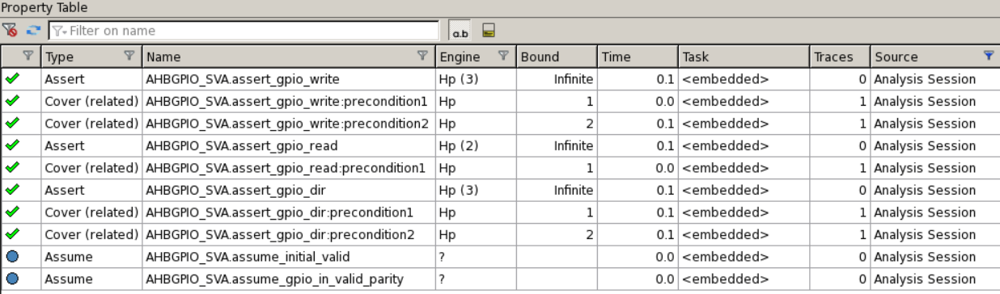
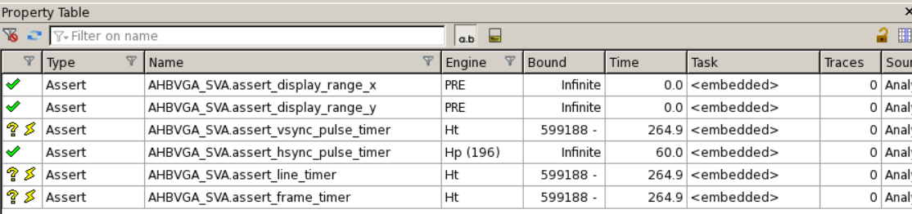

# Hardware Verification Coursework 2022-23

## Verification Plan

The verification plan can be found [here](verificationPlan.md).

## File map

- [Makefile](Makefile): commands to run simulation and coverage for VGA and GPIO unit-level testing and top-level testing
- [Basic GPIO Coverage](coverage/GPIOCoverageReport.txt): Generated in Questa GUI
- [Full GPIO Coverage](coverage/GPIOCoverageReportFull.txt): Generated using `vcover` command
- [Basic VGA Coverage](coverage/VGACoverageReport.txt): Generated in Questa GUI
- [Full VGA Coverage](coverage/VGACoverageReportFull.txt): Generated using `vcover` command
- [Docs Folder](docs): Folder of PDF resources provided
- [GPIO Module](rtl/AHB_GPIO/AHBGPIO.sv)
- [GPIO Checker](rtl/AHB_GPIO/ahb_gpio_checker.sv): Non-synthesizable version to check GPIO outputs against
- [GPIO Assertions](rtl/AHB_GPIO/AHBGPIO_SVA.sv): SystemVerilog Assertions for module verification
- [GPIO TCL Script](gpio.tcl): JasperGold script used to run formal verification on the GPIO module
- [GPIO JasperGold Results](GPIO_formal_results.png): Image of JasperGold results table
- [VGA Module](rtl/AHB_VGA/AHBVGASYS.sv)
- [VGA Checker](rtl/AHB_VGA/ahb_vgasys_checker.sv): Non-synthesizable version to check VGA outputs against
- [VGA Assertions](rtl/AHB_VGA/AHBVGASYS_SVA.sv): SystemVerilog Assertions for module verification
- [VGA Comparator](rtl/AHB_VGA/VGACOMPARATOR.sv): Used to verify Dual lock-step operation of VGA modules
- [VGA TCL Script](vga.tcl): JasperGold script used to run formal verification on the VGA module
- [VGA JasperGold Results](VGA_formal_results.png): Image of JasperGold results table
- [Questa Automation Script](setup.do): Runs simulation, logs all waves and opens waveform viewer
- [GPIO Unit-level Testbench](tbench/ahb_gpio_tb.sv)
- [VGA Font Map File](tbench/ahb_vga_font_map.sv)
- [VGA Unit-level Testbench](tbench/ahb_vga_tb.sv)
- [Top-level Integration Testbench](tbench/ahblite_sys_tb.sv)

## VGA Bugs and Workarounds

- It is found that upon reaching the console text region part of the frame, the VGA pixel output will be invalid for the first two pixels and will instead start at pixel_x=2 to pixel_x=240 horizontally, thus there are only 238 pixels of valid console text region
- Some of the timing parameters and porch sizes in the documentation are incorrect, the correct ones were taken from the VGA block's local parameters
- Printing to the second character row of the VGA's console text region creates very unexpected behaviour:
  - The second line will start 2 characters to the left of the first line
  - Sometimes, errernous/extra characters may be printed
- The HRESETn signal does not properly reset the data in the console text register, when performing a reset in between test-cases, this may cause the new text on screen to have some characters from the old text (whereas some characters may be reset properly)
- For the VGA Tb, only the first line was tested (Printing a total of 30 random characters for the line)
- The VSYNC and HSYNC pulses after the HRESETn signal is asserted may sometimes only go low for a single cycle (this causes a few assertions to fail thus some special cases were included to these)

## Running Instructions

- Run `make (vga|gpio|sys)` to run each of the testbenches and start Questa, along with selecting all pins and opening the waveform
- Run `jg (gpio.tcl|vga.tcl)` to run formal verification for the GPIO/VGA modules respectively

## Formal Verification Results

It can be seen that all required assertions have been proven with an unbounded result.

The pixel coordinate values are proven unbounded, as well as the HSYNC pulse size, however the remaining assertions are shown to never fail within the given bound (599188 cycles).

## Functional and Code Coverage

The GPIO coverage file can be found [here](coverage/GPIOCoverageReportFull.txt), with the functional coverage results found near the bottom of the file.

The VGA coverage file can be found [here](coverage/VGACoverageReportFull.txt), with the functional coverage results found near the bottom of the file.

## VGA Testing

Using the debug output of `$display` commands to render a 1-bit image of the VGA block output, along with a unicode version (located near the bottom of the log) of the randomly selected symbols from the font RAM.

[VGA Simulation Log](sim.log): This contains the VGA Pixel output from the simulation.
